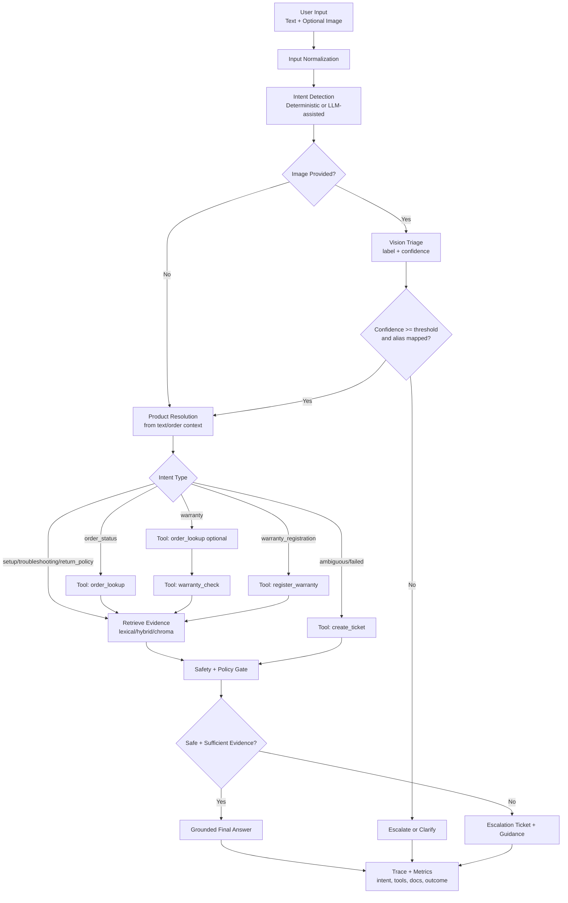
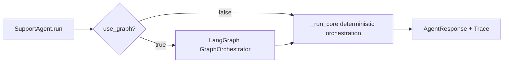

# BrandAssist AI Architecture (Final Implementation Plan)

## 1. System Goal

BrandAssist AI is a multimodal support-agent POC for a pseudonymized, Amazon-style
consumer-electronics marketplace. The system accepts customer text and optional
image context, identifies intent and likely product, retrieves grounded guidance,
calls support tools, and either resolves the case or escalates with a structured
ticket.

Primary supported journeys:

- Order status lookup
- Warranty eligibility check
- Warranty registration
- Product troubleshooting (text and image)
- Return policy guidance

## 2. High-Level Architecture

```text
Customer text + optional image
        |
        v
Intent + product resolution (deterministic or LLM-assisted)
        |
        +--> Vision classification (free multimodal model) + alias mapping
        +--> Structured tools (order/warranty/registration/ticket)
        +--> RAG retrieval (Chroma vectors, filtered by product/category)
        |
        v
Safety gate (confidence + policy rules)
        |
        +--> Resolved grounded answer
        +--> Clarification question
        +--> Escalation ticket
        |
        v
Trace + metrics + eval assertions
```

## 3. Data Architecture

The system uses a split-source design:

### 3.1 Canonical Transaction Store (SQLite)

SQLite is the source of truth for structured entities:

- `products`
- `customers`
- `orders`
- `warranty_policies`
- `warranty_registrations`
- `support_cases`
- `knowledge_documents` (full article/manual text)

### 3.2 Retrieval Index (Chroma)

Chroma stores derived retrieval data:

- `knowledge_chunks` (chunk text + embeddings + metadata)
- Metadata fields: `doc_id`, `product_id`, `doc_type`, `section`, `source`

Design rule: Chroma is a rebuildable index, not the canonical store.

### 3.3 Seed Dataset Targets

Synthetic, reproducible seed data (pseudonymized):

- 20-30 products
- 100 users
- 100 orders
- 50-60 warranty registrations
- 100 support cases
- Fabricated product-specific knowledge articles/manuals

## 4. Product and Vision Mapping Strategy

Products are pseudonymized but realistic (AC, toaster, microwave, purifier, etc.).

Each product maintains:

- `product_id` (canonical internal ID)
- `display_name` (user-facing pseudonym)
- `vision_aliases` (generic labels expected from free vision models)

Image flow:

1. Free multimodal model predicts label + confidence.
2. Alias mapper converts predicted label to canonical `product_id`.
3. If confidence/mapping is weak, ask clarification or escalate.
4. If mapped confidently, run product-specific troubleshooting RAG.

## 5. Orchestration Model

The runtime supports two execution paths:

- Deterministic orchestrator (default, test-stable)
- LLM-assisted orchestrator (free model where available) with deterministic fallback

LangGraph is used as the explicit state-machine boundary.

Typical graph nodes:

1. Input normalization
2. Intent detection
3. Vision triage (optional)
4. Product resolution
5. Retrieval planning + retrieval
6. Tool execution
7. Safety/evidence gate
8. Response generation
9. Escalation/ticket finalization

## 6. Tooling Layer

Core tools:

- `product_lookup`
- `order_lookup`
- `warranty_check`
- `register_warranty`
- `create_ticket`

Tool outputs are structured and included in run trace for eval assertions.

## 7. RAG Design

RAG uses knowledge documents that are product-specific or policy-global.

Pipeline:

1. Store full document in SQLite (`knowledge_documents`).
2. Chunk documents (with overlap).
3. Generate embeddings.
4. Upsert chunks + metadata into Chroma.
5. Query top-k chunks with optional `product_id` filter.
6. Compose grounded response from retrieved evidence + tool outputs.

Fallback retrieval modes:

- Lexical (deterministic baseline)
- Hybrid lexical rerank
- Chroma vector retrieval

## 8. Safety and Governance

Bounded autonomy rules:

- No autonomous approval of refunds/replacements/final warranty payouts.
- Low-confidence image or ambiguous product mapping triggers clarification/escalation.
- Prompt-injection language does not bypass policy/tools.
- Repeated failed troubleshooting triggers escalation.

Data governance:

- Public repo uses pseudonymized products and synthetic customer/order data.
- No redistribution of proprietary manuals in source control.
- Optional live-ingest mode requires source attribution/license checks.

## 9. Evaluation Architecture

Evaluation is behavior-first, not prose-first.

Test layers:

- Golden cases for end-to-end behavior
- Tool-call correctness checks
- Escalation correctness checks
- Mode parity checks (direct vs LangGraph)
- Retrieval checks (`hit@k` / expected-doc presence)

Primary metrics:

- Resolution rate
- Escalation rate
- Visual identification accuracy
- Tool-call correctness
- First-contact-resolution proxy
- Backlog reduction proxy

## 10. Main Modules

| Module | Responsibility |
|---|---|
| `app.py` | Streamlit UI (locked demo config), trace panel, metrics, data workbench, and image upload. |
| `src/brandassist_ai/agent.py` | Core orchestration logic, runtime modes, safety gates, response shaping. |
| `src/brandassist_ai/orchestration.py` | LangGraph orchestrator wrapper and state execution path. |
| `src/brandassist_ai/retrieval.py` | Lexical, hybrid, and Chroma vector retrievers. |
| `src/brandassist_ai/llm_router.py` | Multi-provider LLM/vision routing (Groq/OpenRouter/HF/OpenAI) with fallback. |
| `src/brandassist_ai/tools.py` | Structured support tools for product/order/warranty/ticket flows. |
| `src/brandassist_ai/vision.py` | Image triage: deterministic labels (evals) and free vision-model identification with alias mapping. |
| `src/brandassist_ai/data_loader.py` | DB-first loaders (SQLite) with JSON fallback. |
| `src/brandassist_ai/metrics.py` | Aggregate metrics for eval and dashboard reporting. |

## 11. Evolution Path

Implemented in this POC:

1. SQLite schema + seed generator + validation.
2. Chroma ingestion from canonical knowledge docs.
3. Warranty registration flow end-to-end.
4. Free-model vision adapter with alias mapping.

Remaining toward production:

5. Retrieval benchmarking (`hit@k`, MRR) and CI gating thresholds.

This keeps the POC demo-ready now while preserving a clean path to production-grade
architecture.

## 12. Orchestration and Tool-Calling Diagrams

### 12.1 End-to-End Orchestration Flow



### 12.2 Execution Wrapper View



## 13. Design Decisions and Tradeoffs

| Decision | Choice made | Alternatives considered | Why / tradeoff |
|---|---|---|---|
| Agent topology | Single agent with intent routing | Multi-agent framework (CrewAI/AutoGen) | Scope is five bounded journeys; one router is simpler, cheaper, and easier to trace. "Subagent" maps to an intent/handler branch. Tradeoff: less suited to open-ended task decomposition. |
| Runtime | Deterministic core + optional LLM assist with fallback | LLM-first orchestration | Reproducible tests/grading, resilient to free-tier outages, and tools/policy can never be bypassed. Tradeoff: the deterministic router has weaker NLU on unusual phrasings (visible in the eval Route score). |
| Structured store | SQLite canonical + Chroma rebuildable index | Single store; Postgres + pgvector | Zero-setup local demo with a clean source-of-truth vs derived-index split. Tradeoff: not concurrent/scalable; Postgres + pgvector is the documented production path. |
| Retrieval | Hybrid (lexical + policy/category rerank) by default | Pure lexical; pure vector (Chroma) | Local, fast, deterministic, strong policy recall with no embedding service needed. Tradeoff: heuristic rather than fully semantic; Chroma mode available when true vectors are wanted. |
| Image ID | Free multimodal model + alias map | Custom-trained classifier | No training data/cost; generic labels map to pseudonymized product IDs. Tradeoff: depends on a provider and the catalog alias map; deterministic labels are used for reproducible evals. |
| LLM access | Multi-provider router (Groq -> OpenRouter -> HF -> OpenAI) | Single provider | Free-tier resilience via fallback. Tradeoff: provider/API variability (e.g. JSON formatting quirks), handled with tolerant parsing. |
| Orchestration | LangGraph explicit state machine wrapping the core | Ad-hoc function calls | Explicit, observable orchestration boundary. Tradeoff: an extra dependency for a mostly linear flow. |
| Cost control | Token/cost accounting per turn + a Cost eval dimension | No cost tracking | Surfaces spend in the trace and gates it in evals. Tradeoff: pricing is a representative estimate, not a billed figure. |
| PII | Avoid by design + redact at the LLM boundary | Rely on synthetic data alone | Defends against PII a real user types into chat. Tradeoff: regex redaction covers common direct identifiers, not every possible format. |
| Autonomy | Clarify/escalate first; never auto-approve | Auto-act on best guess | Bounded autonomy keeps the agent safe. Tradeoff: more clarification turns on low-information inputs. |
