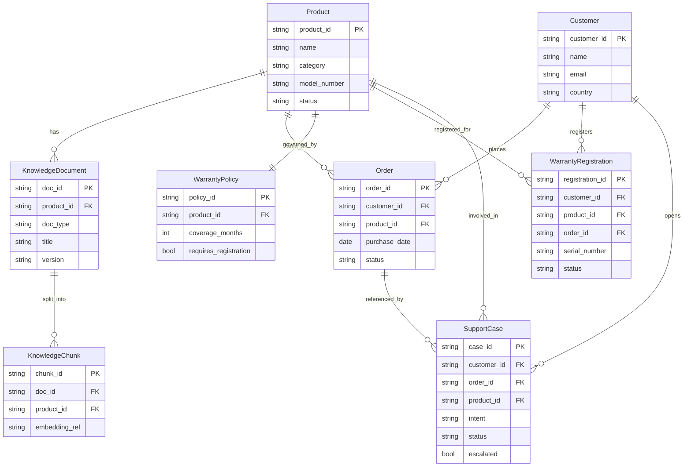

# Data Model

## Goal

Define a minimal, realistic data model for a consumer-goods support agent that
supports troubleshooting RAG, order status, warranty check, and warranty registration.

## Design Principles

- Keep core entities small and implementation-friendly.
- Separate structured transactional data from unstructured knowledge data.
- Preserve traceability for evals and support case audits.
- Support deterministic local mode and future production integrations.

## Entity Overview

1. `Product`
2. `KnowledgeDocument`
3. `KnowledgeChunk`
4. `Customer`
5. `Order`
6. `WarrantyPolicy`
7. `WarrantyRegistration`
8. `SupportCase`
9. `AgentRunTrace` (optional but recommended for observability)

## Entity Definitions

### 1) Product

Represents a sellable appliance/device model.

Fields:

- `product_id` (string, PK) - stable ID (e.g., `microchef-20l`)
- `name` (string)
- `category` (string)
- `model_number` (string)
- `aliases` (array[string])
- `tags` (array[string])
- `status` (enum: `active`, `retired`)
- `launch_date` (date, optional)

---

### 2) KnowledgeDocument

Represents a source manual, policy, FAQ, or troubleshooting guide.

Fields:

- `doc_id` (string, PK)
- `product_id` (string, nullable FK -> `Product.product_id`)
- `doc_type` (enum: `manual`, `faq`, `policy`, `troubleshooting`, `safety`)
- `title` (string)
- `source_url` (string, optional)
- `version` (string, optional)
- `updated_at` (datetime, optional)
- `text` (string)

Notes:

- `product_id = null` is allowed for global policies (returns/warranty policy).

---

### 3) KnowledgeChunk

Chunked representation used for retrieval/vector indexing.

Fields:

- `chunk_id` (string, PK)
- `doc_id` (string, FK -> `KnowledgeDocument.doc_id`)
- `product_id` (string, nullable FK -> `Product.product_id`)
- `chunk_text` (string)
- `section` (string, optional)
- `start_char` (int, optional)
- `end_char` (int, optional)
- `embedding_ref` (string, optional; vector DB document ID)
- `metadata` (object/json, optional)

Notes:

- Can be materialized in JSON for local mode and mirrored in Chroma for vector mode.

---

### 4) Customer

End user or buyer identity for orders and warranty registration.

Fields:

- `customer_id` (string, PK)
- `name` (string)
- `email` (string)
- `phone` (string, optional)
- `country` (string, optional)
- `consent_marketing` (bool, optional)

---

### 5) Order

Purchase record used in order lookup and warranty validation.

Fields:

- `order_id` (string, PK)
- `customer_id` (string, FK -> `Customer.customer_id`, optional for POC)
- `product_id` (string, FK -> `Product.product_id`)
- `purchase_date` (date)
- `status` (enum: `processing`, `shipped`, `delivered`, `cancelled`, `returned`)
- `delivery_eta` (date/string, optional)
- `seller_channel` (string, optional: `web`, `marketplace`, `retail`)

---

### 6) WarrantyPolicy

Policy configuration by product.

Fields:

- `policy_id` (string, PK)
- `product_id` (string, FK -> `Product.product_id`)
- `coverage_months` (int)
- `requires_registration` (bool)
- `requires_order_or_proof` (bool)
- `regions` (array[string], optional)
- `terms_url` (string, optional)
- `exclusions` (array[string], optional)

---

### 7) WarrantyRegistration

Customer registration event for warranty entitlement.

Fields:

- `registration_id` (string, PK)
- `customer_id` (string, FK -> `Customer.customer_id`)
- `product_id` (string, FK -> `Product.product_id`)
- `serial_number` (string)
- `order_id` (string, nullable FK -> `Order.order_id`)
- `proof_of_purchase_url` (string, optional)
- `registered_at` (datetime)
- `warranty_start_date` (date)
- `warranty_end_date` (date)
- `status` (enum: `active`, `rejected`, `expired`)

Constraints:

- Unique(`serial_number`, `product_id`) to prevent duplicate registrations.

---

### 8) SupportCase

Escalated or tracked support interaction.

Fields:

- `case_id` (string, PK)
- `customer_id` (string, nullable FK -> `Customer.customer_id`)
- `order_id` (string, nullable FK -> `Order.order_id`)
- `product_id` (string, nullable FK -> `Product.product_id`)
- `intent` (enum: `setup`, `troubleshooting`, `order_status`, `warranty`, `return_policy`, `general_support`)
- `summary` (string)
- `status` (enum: `open`, `in_progress`, `resolved`, `closed`)
- `resolution` (string, optional)
- `escalated` (bool)
- `created_at` (datetime)
- `updated_at` (datetime, optional)

---

### 9) AgentRunTrace (Recommended)

Observability artifact for evals and debugging.

Fields:

- `run_id` (string, PK)
- `message` (string)
- `image_id` (string, optional)
- `intent` (string)
- `product_id` (string, nullable)
- `retrieved_doc_ids` (array[string])
- `tool_calls` (array[object])
- `outcome` (enum: `resolved`, `clarify`, `unsupported`, `escalated`, `unresolved`)
- `escalated` (bool)
- `latency_ms` (int, optional)
- `model_name` (string, optional)
- `cost_estimate` (number, optional)
- `created_at` (datetime)

## Logical Relationships

- `Product` 1 -> many `KnowledgeDocument`
- `KnowledgeDocument` 1 -> many `KnowledgeChunk`
- `Product` 1 -> many `Order`
- `Product` 1 -> 1 `WarrantyPolicy`
- `Customer` 1 -> many `Order`
- `Customer` 1 -> many `WarrantyRegistration`
- `Product` 1 -> many `WarrantyRegistration`
- `Order` 0..1 -> many `SupportCase`
- `Product` 0..1 -> many `SupportCase`

## ERD Diagram

## Minimal POC Storage Mapping

- `Product` -> `data/brand/products.json`
- `KnowledgeDocument` -> `data/brand/knowledge_base.json`
- `Order` -> `data/brand/orders.json`
- `WarrantyPolicy` -> `data/brand/warranties.json`
- `WarrantyRegistration` -> `data/brand/warranty_registrations.json` (to add)
- `SupportCase` -> ticket store (currently in-memory tool; can move to JSON/db)
- `AgentRunTrace` -> app session traces / exported eval outputs

## Warranty Flow Mapping

### Warranty Check

Inputs:

- `product_id`
- one of: `order_id` OR (`serial_number` + `registration_id`)

Validation steps:

1. Resolve product and policy.
2. Validate order/registration requirement.
3. Compute entitlement window from purchase/registration date.
4. Return eligibility + reason + next action.

### Register Warranty

Inputs:

- `customer_id`, `product_id`, `serial_number`
- optional `order_id`, `proof_of_purchase_url`

Validation steps:

1. Confirm product exists.
2. Check duplicate serial registration.
3. Create registration and compute start/end dates.
4. Return `registration_id`, `status`, and warranty window.

## Suggested Next Implementation Step

Add `WarrantyRegistration` model + loader and seed `data/brand/warranty_registrations.json`,
then implement `register_warranty` tool and tests before wiring the agent intent path.

## Extensibility Architecture (Future-Proofing)

To keep the project easy to evolve during eval cycles, apply these rules when adding
new data requirements.

### 1) Version Every Schema

Add a top-level schema/version marker to each JSON dataset:

- `_schema_version`: integer (e.g., `1`)
- `_generated_at`: ISO timestamp (optional)

Benefits:

- Enables non-breaking migrations.
- Makes test fixtures deterministic and auditable.

### 2) Prefer Additive Changes

When new fields are needed, follow this order:

1. Add new field as optional with sane default in loader/model layer.
2. Keep existing fields untouched.
3. Backfill older seed files only when needed.

Avoid renaming/removing fields directly in first pass; deprecate first, then migrate.

### 3) Reserve Extensible Metadata

Every major entity should support optional extension metadata:

- `metadata` (object/json, optional)
- `source` (string, optional)
- `tags` (array[string], optional)

Use this for pilot attributes discovered during tests (region flags, policy notes,
channel-specific constraints) without changing core schema immediately.

### 4) Keep Enums Soft at Storage Boundary

In code, enforce known enum values. In raw data, tolerate unknown values and map them:

- Known -> first-class enum behavior
- Unknown -> `other` + warning in trace

This prevents test data from breaking the entire run when new categories appear.

### 5) Add a Data Validation Layer

Introduce `validate_data.py` (or pydantic validators) to check:

- required keys
- ID uniqueness
- foreign-key references
- date format validity
- duplicate serial/order conflicts

Run validation before tests to fail fast with actionable errors.

### 6) Separate Canonical Data vs Test Fixtures

Keep two layers:

- Canonical base data (`data/brand/`)
- Scenario overlays for tests (`data/evals/fixtures/`)

Tests can inject edge-case overlays (missing warranty, duplicate serial, expired policy)
without polluting core datasets.

### 7) Add Migration Hooks Early

Create a lightweight migration utility:

- input: dataset + current `_schema_version`
- output: latest shape

Even a simple function map (v1 -> v2 -> v3) gives safe forward evolution.

### 8) Backward-Compatible Loader Contract

Loader functions should:

- tolerate absent optional fields
- apply defaults centrally
- emit warnings for deprecated fields

This ensures old test snapshots continue to run after schema upgrades.

### 9) Suggested “Room-for-Improvement” Fields

Keep these optional now, promote later if repeatedly used:

- `Product`: `region_availability`, `replacement_parts`
- `Order`: `fulfillment_node`, `return_window_end`
- `WarrantyPolicy`: `accidental_damage_covered`, `claim_sla_days`
- `WarrantyRegistration`: `validation_status`, `rejection_reason`
- `SupportCase`: `severity`, `root_cause`, `resolution_code`
- `KnowledgeDocument`: `locale`, `compliance_scope`, `effective_from`

### 10) Architecture Rule for New Data Requests

When tests reveal missing data:

1. Add the data in fixture overlay first.
2. Add optional schema field and loader default.
3. Add one regression test.
4. Promote to canonical dataset only if reused across scenarios.

This keeps the model lean while still evolving quickly.
